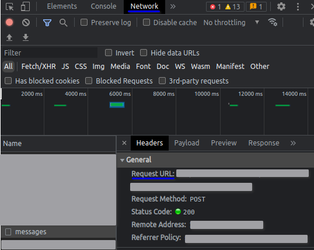
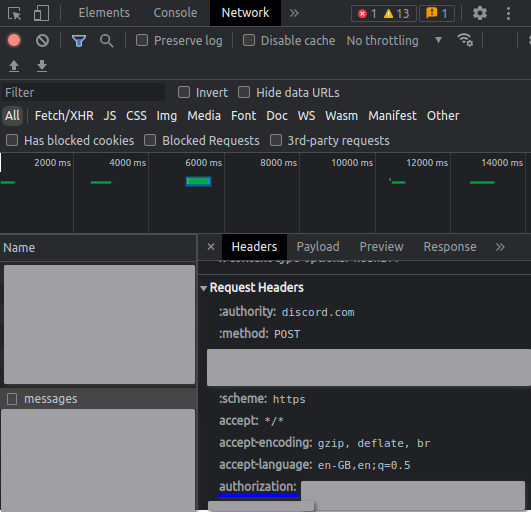
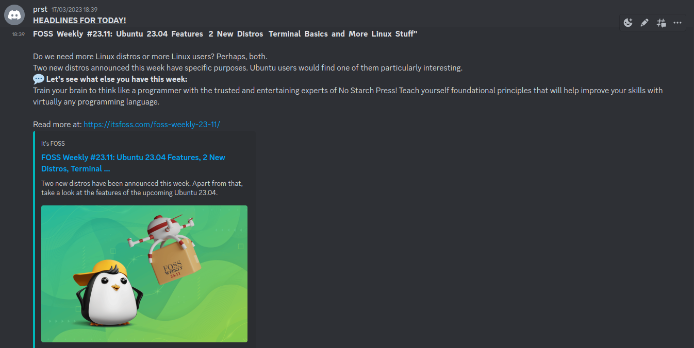

<font size = 3>
<center> 

# ItsFoss Scraper
</center>

## Project Description
<p>This project will acquire the articles posted at <a>https://itsfoss.com/</a> from the <b>Latest</b> section. It will then proceed to acquire the first 4 paragraphs of each new article and send them to a discord channel</p>
<p>This project is written in python and uses the following libraries</p>

<ol>
    <li>requests: <a>https://pypi.org/project/requests/</a></li>
    <li>bs4: <a>https://pypi.org/project/bs4/</a></li>
    <li>plyer: <a>https://pypi.org/project/plyer/</a></li>
</ol>

## Running the project
The following are the functions of the different modules written for the project
<center>

|Sno|Module name|Functionality|
|---|-----------|-------------|
|1|`get_link.py`|Acquires the links of all articles in the latest section|
|2|`get_content.py`|Cleans the links of any unwanted characters and also acquires the content of each link|
|3|`bot.py`|Makes a request to the discord webapp and posts the message|
|4|`send.py`|Cleans the old headlines which have been sent and formats the above contents and makes a message to be send|
|5|`notify.py`|It generates a notification to the user upon function call|
|6|`main.py`|Integrates both `send.py` and `notify.py` to make the final app|
</center>

To run the project, one needs to edit the `bot.py` script. I
 
to the channel link and authorisation token. The values can be accessed only on the discord webapp from the network section and messages when a new message is sent. The `"channel_link"` will be found as shown in the image. <br>
<center>
<br>
</center>
The value of the request url is to be copied and needs to replace `channel-link` with the value copied in the following lines

```python
url = "channel-link"
```
Then the following value has to be copied as shown in the image<br>

<center>
<br>
</center>
And the `authorization-token` has to be replaced with the copied value

```python
auth = {
        'authorization' : 'authorization-token'
    }
```
The project can then be run.
>Source: <a>https://www.youtube.com/watch?v=DArlLAq56Mo</a>
## How to use this project
This project is an automation script and can be made to run forever. A test example has been shown here below<br>
<center>
    
</center>

## Credits
Although this project was done solely, it would not have been possible without the help of the following articles/videos. 
<ol>
    <li>Requests documentation: <a>https://requests.readthedocs.io/en/latest/</a></li>
    <li>BeautifulSoup documentation: <a>https://www.crummy.com/software/BeautifulSoup/bs4/doc/</a></li>
    <li>Send a message on discord using requests: <a>https://www.youtube.com/watch?v=DArlLAq56Mo</a></li>
</ol>
</font>
